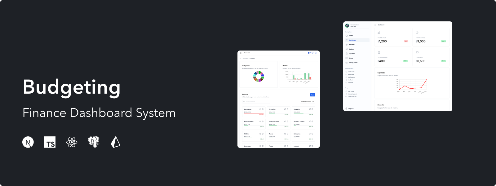
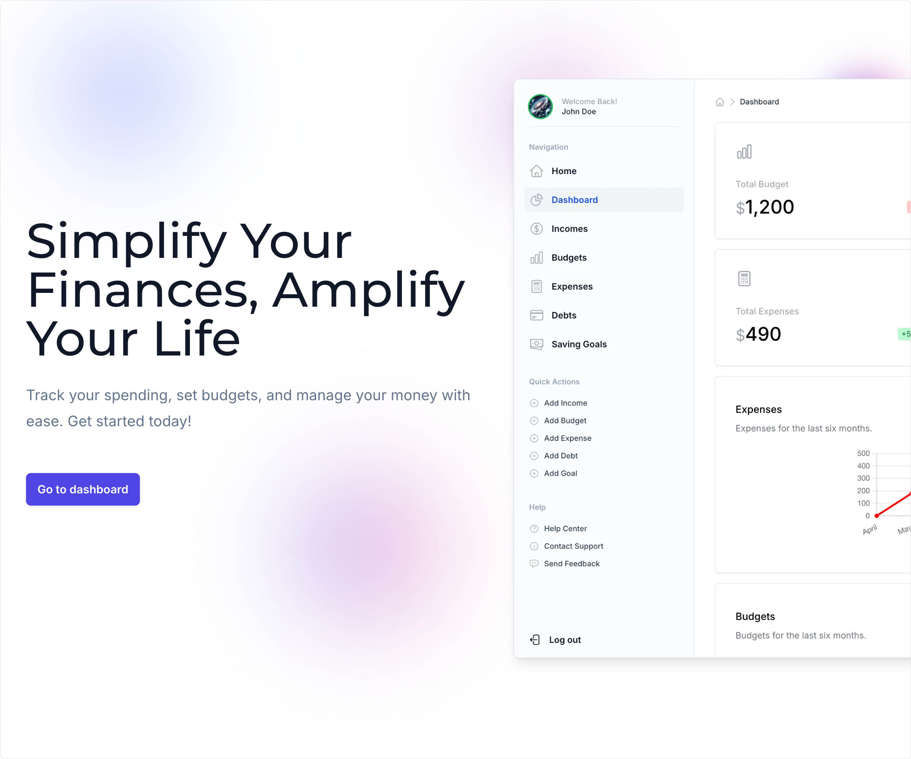

<p align="center">
    
</p>
<h1 align="center">Personal Finance Tracker</h1>
<p align="center">
The Personal Finance Tracker is an open-source app <br> designed to help users manage their budgets, incomes, expenses, debts, and savings goals. It provides visual representations, such as pie charts for budget categories and bar charts for comparing budgets versus spending over the last six months. Users can easily search and filter data by month, while the dashboard offers an overview of total budgets, incomes, expenses, and more.
<p align="center">
    
    
    
</p>

<p align="center">
    
    <br>
    <em>Figure 1: homepage</em>
</p>

## Video
See the video below for a demo of the app:

<video controls src="https://github.com/user-attachments/assets/583fc462-467e-4963-8d7f-53e4edeae3cd"></video>


## Tech Stack

| Technology       | Description                                                                                                           |
|------------------|-----------------------------------------------------------------------------------------------------------------------|
| **Charts**       | [Chart.js](https://www.chartjs.org/) - A simple yet flexible JavaScript charting library for designers and developers. |
| **Framework**    | [Next.js](https://nextjs.org/) - A React framework for building server-side rendered and static web applications.     |
| **Backend**      | [Node.js](https://nodejs.org/) - A JavaScript runtime built on Chrome's V8 JavaScript engine, used for building scalable network applications. |
| **ORM**          | [Prisma](https://www.prisma.io/) - An open-source ORM for Node.js and TypeScript that helps manage and interact with your database. |
| **Database**     | [PostgreSQL](https://www.postgresql.org/) - A powerful, open-source object-relational database system with a strong reputation for reliability and performance. |
| **Authentication** | [Auth.js v5](https://authjs.dev/) - A library for handling authentication in JavaScript applications, providing secure and easy-to-use authentication methods. |
| **Containerization** | [Docker](https://www.docker.com/) - A platform for developing, shipping, and running applications in containers, enabling consistent environments across development and production. |

## Environment Variables

To run this project, you will need to add the following environment variables to your `.env` file:


| Environment Variable      | Description                                                                                                           |
|---------------------------|-----------------------------------------------------------------------------------------------------------------------|
| `AUTH_SECRET`             | A secret key for authentication. You can generate a secret key by running the command `openssl rand -base64 32` in your terminal. Ensure OpenSSL is installed: <br> - **macOS/Linux**: OpenSSL is usually pre-installed. Verify by running `openssl version`. <br> - **Windows**: Install OpenSSL from the [OpenSSL website](https://www.openssl.org/) or using [Chocolatey](https://chocolatey.org/) with the command `choco install openssl`. |
| `AUTH_TRUST_HOST`         | Set to `true` or `false` to indicate whether to trust the host for authentication.                                     |
| `POSTGRES_USER`           | The PostgreSQL database username.                                                                                      |
| `POSTGRES_PASSWORD`       | The PostgreSQL database password.                                                                                      |
| `POSTGRES_HOST`           | The PostgreSQL database host. Use `localhost` for local development or the Docker Compose service name `postgres`.     |
| `POSTGRES_DB`             | The PostgreSQL database name.                                                                                          |
| `POSTGRES_PORT`           | The PostgreSQL database port.                                                                                          |
| `POSTGRES_URL`            | The PostgreSQL connection URL, which is constructed using the above variables.                                         |

## Dashboard Access

> \[!CAUTION]
>
> **Authentication:** This is a basic authentication password for testing purposes. For a production-grade application, you should use an authentication provider such as GitHub or [any of these providers](https://authjs.dev/getting-started/authentication/oauth). The providers should be configured in the `auth.config.ts` file.

To test the dashboard, use the following credentials:

-   **Username:** `example@example.com`
-   **Password:** AhRX8LioQKpMTg7

## Running the App

### Using Docker

To run the app in a Docker container, follow these steps:

1. Clone the repository
    ```sh
    git clone https://github.com/albdangarcia/personal-finance-tracker.git
    ```
1. Navigate to the project directory
    ```shell
    cd personal-finance-tracker
    ```
1. Copy the `.env.example` file to `.env` and update the environment variables:
    ```sh
    cp .env.example .env
    ```
1. Build the Docker image:
    ```sh
    docker compose build
    ```
1. Run the Docker container:
    ```sh
    docker compose up
    ```
1. Open your browser and navigate to `http://localhost:3000`


### Run Locally

To run the app locally, follow these steps:

1. Clone the repository
    ```sh
    git clone https://github.com/albdangarcia/personal-finance-tracker.git
    ```
1. Navigate to the project directory
    ```shell
    cd personal-finance-tracker
    ```
1. Copy the `.env.example` file to `.env` and update the environment variables:
    ```sh
    cp .env.example .env
    ```
1. Download the official PostgreSQL image from Docker Hub:
    ```sh
    docker pull postgres
    ```
1. Start the PostgreSQL container (This step starts a new PostgreSQL container with the specified password and user):
    ```sh
    docker run --name some-postgres -e POSTGRES_PASSWORD=mysecretpassword -d postgres
    ```
1. Install the dependencies:
    ```sh
    npm install
    ```
1. Push the Prisma schema to the database:
    ```sh
    npx prisma db push
    ```
1. Push the Prisma schema to the database:
    ```sh
    npx prisma generate
    ```
1. Seed the database:
    ```sh
    npx prisma db seed
    ```
1. Run the app:
    ```sh
    npm run dev
    ```

## TODO

- [x] Import OAuth providers to the login page.
- [x] Show a text message when there is no data to display for the charts.
- [ ] Add a settings page to manage user preferences.
- [ ] Add more visualizations to the dashboard.
- [ ] Implement unit tests with Jest/React Testing Library.

## Contributing

Please follow these steps to contribute:

1. Fork the repository.
1. Create a new branch:
    ```sh
    git checkout -b feature/your-feature-name
    ```
1. Make your changes and commit them:
    ```sh
    git commit -m 'Add some feature'
    ```
1. Push to the branch:
    ```sh
    git push origin feature/your-feature-name
    ```
1. Open a pull request.

## License

Licensed under the [MIT](LICENSE) license.
